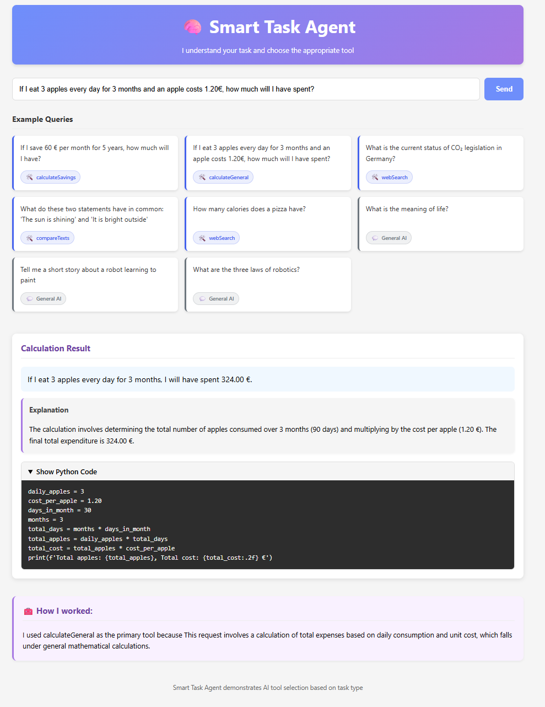

# Auto-RAG Smart Task Agent

An intelligent application that recognizes task types and automatically employs the appropriate tools.

## Features

- 🧠 Automatic recognition of task type
- 🔢 Financial and general calculations with high precision
- 📊 Text analysis and comparison
- 🔍 Web search for questions requiring research
- 💬 General AI answers for simple questions
- ⛓️ **Dynamic Tool Chaining** (BETA) - Automatically combines multiple tools to solve complex tasks

## Available Tools

- **calculateSavings()**: Calculates savings totals with or without interest
- **calculateGeneral()**: Performs precise mathematical calculations with detailed explanations
- **compareTexts()**: Compares two texts for semantic similarities
- **webSearch()**: Searches for current information on the web using Google Search API
- **textSummarizer()**: Summarizes long texts

## How It Works

1. The user submits a query
2. The system analyzes the query to determine the appropriate tool
3. The selected tool processes the query
4. Results are displayed with an explanation of the system's reasoning

### For Calculations

The system uses specialized mathematical algorithms with financial precision. For general calculations, it creates a detailed explanation with step-by-step workings and mathematical reasoning, including Python code for verification.

### Dynamic Tool Chaining

For complex queries that require multiple processing steps, the system can:

1. Analyze the query and create a step-by-step tool execution plan
2. Execute each tool in sequence, using outputs from previous steps as inputs to subsequent steps
3. Combine the results into a cohesive answer
4. Provide transparency by showing the chain of tools used

Example chains:

- Web search → Text summarization → Calculation
- Web search → Text comparison
- Calculation → Text formatting

This feature allows the system to handle much more complex tasks that would be impossible with a single tool.

## System Architecture

This application implements a smart AI orchestration system that:

1.  **Analyzes queries** to identify the underlying task type
2.  **Selects specialized tools** appropriate for each task
3.  **Routes processing** to task-specific handlers
4.  **Provides transparency** by explaining tool selection decisions

While similar to Retrieval-Augmented Generation (RAG) systems, our approach focuses on tool selection and task routing rather than pure knowledge retrieval. This creates a more adaptable system that can handle a diverse range of queries with specialized processing strategies.

## Changelog

See the [CHANGELOG.md](CHANGELOG.md) file for a detailed list of changes for each version of the project.

## Technologies

- React for the frontend
- Azure OpenAI API for AI functions
- RapidAPI Google Search for web queries
- Modern JavaScript with async/await patterns

## Installation

1. Clone the repository
2. Install dependencies with `npm install`
3. Start the application with `npm start`

## Environment Variables

The application requires the following environment variables in a `.env` file:

- REACT_APP_GLOBAL_LLM_SERVICE="AzureOpenAI"
- REACT_APP_AZURE_OPENAI_CHAT_DEPLOYMENT_NAME="gpt-4o-mini"
- REACT_APP_AZURE_OPENAI_EMBEDDING_DEPLOYMENT_NAME="ada"
- REACT_APP_AZURE_OPENAI_ENDPOINT="https://your-endpoint.openai.azure.com/"
- REACT_APP_AZURE_OPENAI_API_KEY="your-api-key"
- REACT_APP_RAPIDAPI_KEY="your_api_key"

## Example Queries

- If I save 60 € per month for 5 years, how much will I have?

- If I eat 3 apples every day for 3 months and an apple costs 1.20€, how much will I have spent?

- What is the current status of CO₂ legislation in Germany?

- What do these two statements have in common: 'The sun is shining' and 'It is bright outside'

- How many calories does a pizza have?
